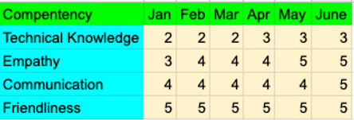

## Introduction

Developing support team members from new hires to company superstars is something I’m passionate about.  By outlining a program that provides a structured feedback mechanism during training and professional growth, your team and company will prosper.  The information below is based upon my experience as a frontline support engineer (as well as being a team leader) to explain an effective way to interact with support personnel.

## Training

Generally there needs to be some level of structured training, not only with the product but also the tools used on a regular basis.  Some companies have multiple week-long training courses to help the new user become familiar with how the service solves pain points for the customers.  Some companies don’t provide any training.  I believe nothing helps Support Engineers learn faster than by engaging with real customer issues, so I want to spend the minimum amount of time training in the classroom and more time in the world.

On day one the new hire needs access to all the support tools they will need to complete their job.  Hopefully most of the tools are fairly intuitive but for any that involve complex processes, the required actions should be well documented.

Most new hires have heard the “10,000-foot overview” about your service multiple times during the interview process so the expectation is they are aware of what value the service provides but feel free to go over that if there is any doubt.

In order to speed up the learning process, I prefer to focus on training the support team member on the top 10 most frequent customer issues for their role.  The training should be open-ended but ideally it can be completed in less than a few days.  At that point, they can be assigned a coach (if the coach is different from the trainer).

## Coaching

A coach is a person who will work with the new hire on actual customer issues.  For the first week or two, the new hire needs confirmation from the coach before they can send responses that can be saved as drafts or internal comments in whichever helpdesk software is being used.  The coach would meet with the new hire twice daily (or more depending on product complexity) and review responses and answer any questions that may have come up.

Sample questions for reviewing customer interactions:

* Was the response accurate?
* Was the response complete?
* Were the next steps explained?
* Was the intent of the customer’s message received?
* Were their needs met?
* Did the reply use active voice?
* Did the reply use positive language?

That is just an example of a handful of questions for inspiration, but it’s definitely not exhaustive if you want to add more or swap out a few.  Whichever questions you chose, they should align with your support team goals.

As time moves on, the schedule of coaching meetings can be moved to once daily, weekly and then finally to on-demand.  At the on-demand point, the individual loses their “new hire” status and becomes more independent.  The coach shouldn’t put any time pressure on the new hire but instead should be focusing on coaching for the highest quality responses.  The response speed will begin to increase as the individual becomes more knowledgeable and confident in their responses.

Depending on the size of your support team, it’s possible that the coach is also the manager. In that case, the new hire might feel more pressure to speed through the coaching than from a peer.  There are arguments that make sense for both, but anecdotally I find that peer feedback is accepted easier and provides a less stressful environment.

## Managing

Upfront communication about what’s expected and how an employee will be evaluated is an effective management strategy.  Ideally, there are regular (weekly/bi-weekly/monthly) one-on-one meetings in which you go over an employee’s performance.  Which metrics are used to judge an employee is highly subjective but I would keep things as simple as possible by picking 4-8 core competencies that can be measured and are important to your customer support team.   These metrics could have a ranking of 1 to 5 (5 being the highest).  Below is an example:

How can you assess this information?  You can use interactions with customers from the time after your last review up until the time of the current review. You’ll need a sufficient sample size to judge the competencies.  If you have 4 competencies, the minimum number of interactions you would want to review is 4 but 8 or more would be recommended.

Hopefully, all of the ratings are trending up or at least remaining stable.  I wouldn’t use the review periods to make snap judgments about a person’s ability to be an effective support team member, but use the information as a tool to guide future performance.

The ultimate goal is to provide support personnel with a feedback mechanism that allows the person to grow as a professional and the manager can feel confident in the individual’s ability to interact with customers.  With that being said, you should also plan for their future.  A couple of common reasons that people seek out new employment are that they are looking for more money and/or career development.

## Salary Increase

Salary increases can be a stressful event for both supervisors and supervisees.  I think being upfront with employees is the best path to follow.  Let them know how they will be evaluated and when to expect raises.  As a manager, often your hands are tied because of budgetary constraints and support might be viewed more as a cost center than a value add.  Offering more salary to workers who are doing a better job and more efficiently makes sense.  Think about how long it takes to train a new hire to be self-sufficient and how long it takes to become an expert.  Is it cheaper to offer more salary to existing employees or to start over with a new hire who may not be effective for 3 to 9 months?

Support does have a high volume of turnover but the next section offers a way to keep good workers and grow them within the company.

## Career Development

I believe it’s extremely important to offer career advancement for your support team regardless of if you are a large or small company. If you are big enough to have a support team, then likely you have options for support personnel to grow into other roles.  The important knowledge you gain on the support team can be applied to other areas of the company.  Support knows the user base, what major paint points there are and what value the service adds.

Once someone becomes successfully trained and their core competencies are established at a high level, the manager can begin asking about their interests.  If they are technical, maybe they want to be an engineer.  They may want to work with product or marketing.  Or possibly they want their manager’s job or to be CEO.  A mentor can be assigned to them that they meet with on a regular basis that is in their targeted field.  In these meetings (typically 15 to 30 minutes) they could ask questions around what their mentor does day-to-day and find out if that sounds like something the support person is interested in.  Providing them with small assignments to complete might be a good way of verifying that the job aligns with their skill set.  A task that might take 2-4 hours per week (taking into account the employee is learning and won’t be able to finish the task as fast as a senior-level person) could be a soft introduction.  Of course the manager would need to allow the support team member to schedule the time to work on the project.

The mentoring idea can be sold to company executives by explaining how it can also save costs on acquiring new talent in the future.  Recruiters and hiring managers can add overhead to each hire. The interview process takes up a large amount of time which can be minimized to one candidate instead of interviewing 10 applicants and sifting through dozens or even hundreds of emails.  You already know the individual’s work ethic and how she gets along with her teammates, all of which are unknown with a new hire.

You also have the option of easing them into the role if you don’t necessarily need a full-time employee but could use help for 10-15 hours.  I would be careful about the length you have someone doing two jobs because it’s possible they could show a preference for one job over the other.

## Conclusion

Keep in mind that the support team is talking to your customers.  There is a debate around whether delighting customers can increase customer loyalty but there is no debate that bad support experiences can cause customers to leave.

The support team needs to know that their work aligns with company goals.  They aren’t doing support, they are building a billion-dollar company.  If they aren’t engaged with the company, how are they going to engage with the customers?

The training, coaching, and managing experience I have outlined takes effort to implement especially if you are a small team with limited resources.  I would argue that putting the extra effort at each level reduces the resources required by the support team and the company as a whole by retaining, educating, and motivating a great customer support team.
