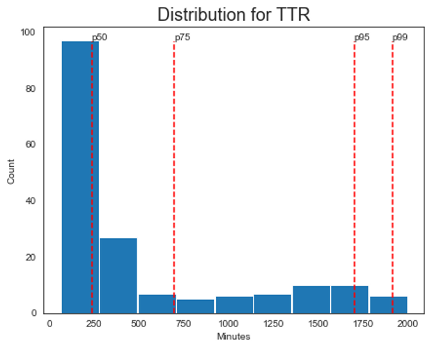

## Introduction

Every customer support organization has metrics that allow them to measure success.  Discovering which set of metrics works for your organization can be a challenging exercise.  Most top-level metrics attempt to represent the entire teams’ effort with a single number. There are a few common issues in using these types of metrics:

1. Fluctuations often produce knee-jerk reactions by decision-makers.

2. Frequently the focus is on manipulating the metrics, not providing great support.

3. Some of the metrics should be owned by the entire organization, not just support.

## Knee-jerk reactions

There are times when key decision-makers look at reports on support and see that a particular metric is at a value other than expected.  Their initial reaction might be to focus on that one area and they may mandate that the particular metric be considered a “high priority” to fix by the support team.

This puts pressure on the entire support team from vice presidents all the way down to the frontline support personnel.  Pressure could also cause changes in procedures and shift focus from in-progress support initiatives to new initiatives focused around the supposedly underperforming metric.

What is wrong with support?  I would ask a different question.  What story do the customer support metrics tell?

For instance, let’s take time to resolution (TTR).  If that number is higher than expected, there can be a lot of causes.  One particular reason is that this is usually a mean value.   So if there are some outliers, that could move the mean value out farther.  Instead of using one value to represent the entirety of support interactions, you could use a histogram chart with percentiles displaying how many tickets were solved in various time buckets.

The mean TTR is 6 hours but in this case, we can see that 50% of the support interactions for this fictional B2B SaaS service were resolved in 4 hours and that there were some outliers that took 33+ hours to solve.

We can take this information further and ask “What types of tickets are requiring the most effort to resolve?”.  Below takes the above histogram but groups the value by ticket category.

From here you can see the “API and Reports” tickets are resolved slower than the rest of the categories.  The percentiles are shifting farther to the right meaning the tickets are requiring more effort (as measured by time) by support.

There are other questions we can ask.  Is the overall resolution time for these categories trending up or down?  Was there a spike for resolution time that we can relate to a new feature release or deploy? Can support improve their process or do other teams need to provide assistance?  Is there a large number of tickets that had to go through the internal investigation?  Does our support personnel have the training they need to solve these types of issues?

TTR could be burying the real story and the insights into what problems there are and how to solve them.

## Metric Manipulation

If support personnel has been incentivized to meet certain criteria or metrics, then they will likely act in a manner that gives them the best results which may or may not be in line with the customer support goals.

What do I mean by that?  When frontline support has individual expectations placed upon them, what could be the unintended consequences on support goals?  I think good goals to have for a customer support organization are:

1. Empathy.  You understand the customers’ issues and relate to them in a human way.

2. Knowledge.  The frontline personnel delivers all the necessary information to the customer.

3. Immediacy.  The issues are handled with a sense of urgency.

What if you tell the support agent that they will be judged on the TTR?  That sounds like a great metric for goal #3.  But what about the other two goals?  Would pressure to resolve tickets faster cause the support team to rush answers that maybe they weren’t sure of?   Would they spend all the time needed to empathize with the customer and understand their issue, or just get out a response to end the interaction?

That doesn’t mean TTR isn’t an important metric, because it is, but it also means that it should be used as a storytelling tool instead of an individual expectation.  Because Betty’s TTR is less than George’s, does that mean Betty is doing a better job?  Could it be George has a larger number of tickets resolved?  Is George answering tickets that are in a category that requires more effort? Is George’s TTR number trending up or down?  Is George’s TTR an outlier for the group or is it around the rest of the teams’ numbers?

Focusing on specific metrics can steer you toward the wrong goals.  Set your goals and figure out how the metrics help tell the story.

## Ambiguous Ownership of Metrics

There are some customer support metrics that should be considered organization-wide metrics.  I’m specifically looking at you Net Promoter Score (NPS).  If you are unfamiliar with NPS, it’s a customer survey that asks a basic question:  “How likely are you to recommend our company to a friend or colleague?”  The customer rates their likelihood on a scale of 1 to 10 and then there’s an opportunity to leave additional information as to why they gave that number.

Why this metric is typically owned by customer support confuses me.  The survey question asks nothing about a particular support interaction or about support in general.  This number is a reflection of the entire user experience within the product.  Support is part of the user experience for sure but so is marketing, design, product, engineering, and all nearly all other roles.  NPS was designed to measure customer loyalty, not customer support.  At the very least, customers that haven’t interacted with support during the survey period should be excluded from the NPS calculation if NPS is being used to evaluate support.

That brings me to CSAT.  CSAT is another survey question that attempts to measure the customers’ sentiment directly after a customer support interaction.  Each neutral or unsatisfied response is considered an unsuccessful interaction for support.  If a customer responds that they had an unsuccessful interaction with the company, was it unsuccessful because of support?  Or was the customer frustrated about a lack of features?  Or were they not returned an informative error message and were irritated they need to contact support for more information?  Was there a recent pricing change?  Breaking down the metric by ticket category, customer persona, and/or customer journey would lead to better information.

My point is that it’s difficult to hold one department of your company to the actions of all the departments of your company.

## Conclusion

A common theme throughout this post is storytelling.  Taking your entire support organization and summing it up with a handful of numbers doesn’t always give an accurate state of support and can also be unfair to reduce individual frontline personnel performance to the same numbers.  Many conditions are fluid and affect support.  User bases change, features are added and improved, new bugs are introduced, ticket volume is different, and pricing changes are just a handful of examples that can impact support metrics.

Which metrics are the most effective?  I would say all of them.  The more data you have the better story you can tell.  You can be 100% acronym compliant with CSAT, CES, NPS, TTR, FTC, or whatever all the cool kids are talking about nowadays.  But you need to ask the right questions about the data.  How does each metric apply to our customer support goals?  How can I measure the quality of service?  How can management and/or decision-makers be informed about the support teams’ progression? What trends are we seeing?

The combination of data, visuals, and storytelling will help support teams discover more valuable and actionable insights.

