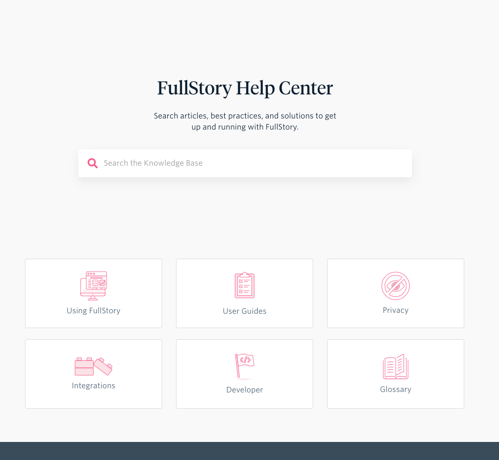
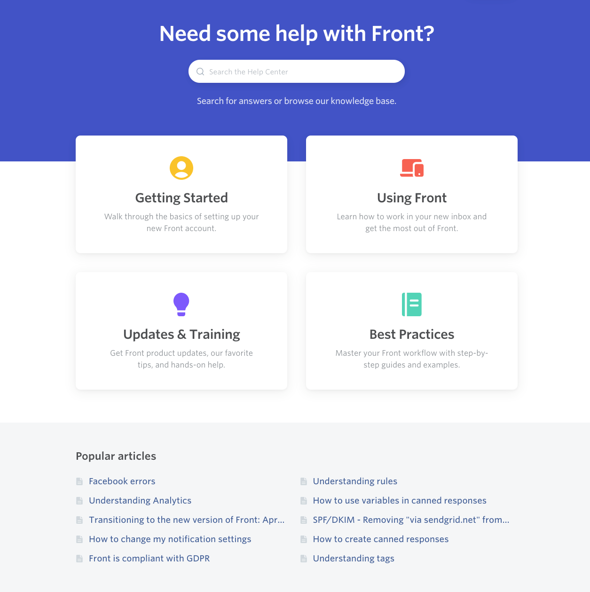

## Introduction

Self-serve documentation (also known as a knowledge base or help center) has become a requirement for products and services.  On the surface, they have many advantages including reducing support interactions, reducing customer effort and also can serve as an information repository for internal teams.

Documentation is always on (hopefully) and never takes a vacation or holiday which gives customers seeking answers outside your time zone an option.

Not all situations can be resolved by self-serve options and some customers will always prefer to interact with support directly.  But we do want to be prepared to allow our customers to go as far as they want with documentation which helps the support team scale by providing answers for lower complexity issues.

Below I outline 4 steps to help get your company and your customers’ maximum value from self-serve documentation.

## Step #1 Start Measuring

Using a static site generator to create your docs can be easy to get going, but there are loads of customer activity that we can collect to make better decisions for product, support and marketing teams.

Selecting what to measure can be up to the organization but in general, defining goals and how to measure those goals is a great starting point.  A typical selection of goals for self-serve would be:

### Goal #1 Reducing Customer Effort

According to the Harvard Business Review article [Stop Trying to Delight Your Customers](https://hbr.org/2010/07/stop-trying-to-delight-your-customers) 57% of customers tried self-serve before needing to interact with the support team.  It’s imperative to provide important information to avoid channel switching, which adds real effort to the customer’s day and ultimately reduces the loyalty for the product and services provided by your company.  Measuring the amount of channel switching can track the progress of the self-serve initiatives.

What things can be measured?

* Does a customer open up a ticket shortly after being on the self-serve site?
* Does a customer open a ticket from the documentation site directly?

### Goal #2 Support Deflection

If we continue with the statement that 57% of support interactions are preceded by an attempt to find an answer on the self-serve site and if half of those customers were to find their answer in the documentation instead of contacting support, that could reduce the overall ticket volume by 28%.  Likely those questions are probably of lower complexity allowing the support personnel to focus more on high complexity topics.

What can be measured?

* What is the ratio of active users to support tickets?
* Did the customer open up a ticket after trying to use self-serve (see goal #1)?
* How are customers rating a particular page’s helpfulness?

### Goal #3 Increase Adoption of Self-serve

There is a possibility that the customers aren’t aware of self-serve options or aren’t aware of how they could answer their questions.

What can be measured?

* What is the ratio of the service’s active users to documentation users?
* What is the ratio of tickets to documentation users?
* Are users returning to self-serve documentation?

## Step #2 Make finding answers easier

Documentation typically focuses on the depth of material instead of how to find answers.  Changing the way the data is displayed to optimize for the latter can increase the chances that self-serve will be able to answer the customers’ questions.

If you believe in the Pareto Principle (I often find the principle to apply), then 20% of the documentation answers 80% of the questions.  That means that the users need to find their way through a maze of unwanted content.  By segmenting the information by customer persona or the step in a customer journey, the customer could focus on the content that’s more relevant to her.

Reducing industry lingo or jargon avoids confusion by the customer.  Most people reading this post probably know what CSAT is but to those that don’t, they now need to google that term for answers.

Perhaps one of the toughest pieces of advice to follow is to reduce familiarity bias.  What I mean by that is that oftentimes the documentation is being written by a subject matter expert which adds a bias based on how familiar they are with a product or service.  Write the documentation as though it’s your first day on the job or as if you are explaining how the service works to a child.

I consider “Search” a requirement for any type of self-serve.  Often a customer only has clues to what they are looking for which they can put in a search bar where it could be difficult to find if the end document is buried under 3+ levels of nesting.

Having search analytics can also help you identify gaps in the knowledge base coverage.  For instance if a search for “Widgets” resulted in zero results, you may want to add a widgets based article if in fact you do have widgets.

My personal preference for self-serve documentation is to use knowledge base documentation in combination with an optimized landing page.  The optimized landing page organizes content in a manner to make it more approachable.  What do I mean?  Let me show some examples:

[FullStory](https://help.fullstory.com/hc/en-us)

What I like:

* The search bar is front and center.
* There are tiles used to group content together.
* Very clean design with minimal distractions.

What I don’t like:
* I’m not entirely sure about the effectiveness of their tiles.  I prefer to focus on either the customer journey or user persona groupings.

[Front](https://help.frontapp.com/)

What I like:

* The search bar is highlighted.
* The top-level categories are grouped by where the customer is in their journey.

What I don’t like:

* I’m not a fan of adding links to popular articles.  This can be distracting for the user who normally visits the help center because of a specific issue.

There are design choices that make finding answers more difficult with many self-serve or knowledge base landing pages.

* No search bar is available.
* Mentioning support options that aren’t available to all customers.
* Too many options/groupings to choose from.
* No landing page at all.
* Large banners that provide no purpose other than aesthetics.
* No options for contacting support.

## Step #3 Promote Self-service

If your customers are not aware of self-serve options you won’t be able to reap all the benefits from making answers easier to find.  Performing actions as simple as including a link to the knowledge base in your response footer could expand that awareness.

Whenever possible, link to documentation in support responses so the customer knows next time that the self-serve option could be the first stop on their quest for answers.  Please only include links as additional information, not as the entire response, that’s just lazy.

If you use an auto-responder, linking to the knowledge base could help as well.  Some customers may find the answer before the agent is able to respond.

## Step #4 Make Documentation Part of the Product

Oftentimes documentation is considered optional in organizations or not part of the release cycle.  Features go out minus any documentation to guide customers or internal users of the product.  Each new release should trigger a quick check on the knowledge base to make sure that ancillary documentation is correct.

Documentation issues plague small and fast-moving companies because oftentimes, things are moving so quickly, that the list of documentation updates can become overwhelming.  Also the scope of the updates can be troublesome as well.  In particular, if you have a knowledge base that’s using a large number of screenshots.  In a fast-moving company the UI changes frequently which could mandate changing multiple screenshots for multiple different feature releases.

To combat needing to update substantial amounts of screenshots, there are several questions you can ask yourself.

* Do I need to show the entire UI, or would zooming into a particular area explain the issue just as well?
* Does the complexity of the explanation require a screenshot or is the screenshot just for aesthetics?
* Will the UI change based on the user’s role?  Or are all UI views consistent across users?
* When using annotations, is the annotation necessary?

For larger companies, there tends to be more internal documentation around new features where the customer-facing documentation could be completed simply by copying the feature specification and adding edits to remove any jargon or complex concepts.  But by not making documentation a release requirement, there are developmental opportunities missed.  Documentation is not just documentation.  It’s also an opportunity to train sales, support, marketing or other parts of the company on the new feature.

When technical writers are tasked with documentation ownership, they typically experience the new feature through the lens of an ideal use case.  They walk through the UI without experiencing any friction.  They enter all the correct information with all the requirements fulfilled and expected options covered. There can be a different experience for users with a reduced set of permissions or maybe the customer is in a different stage of their customer journey.    Knowledge about all the edge cases and non-ideal use cases may not be in the specification and not communicated to the team or individual responsible for updating the documentation.

## Conclusion

Documentation requires commitment from the team and should be treated as a first-class citizen to build loyalty within your customer base.  By following the steps I have outlined, a knowledge base can lead to increased customer loyalty, deflected support tickets and become an effective training aid for internal teams.
